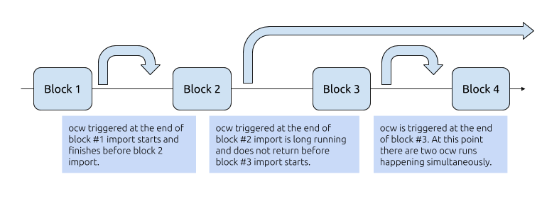

# Local Storage in Off-chain Workers

`pallets/offchain-demo`
[
	
](https://playground-staging.substrate.dev/?deploy=recipes&files=%2Fhome%2Fsubstrate%2Fworkspace%2Fpallets%2Foffchain-demo%2Fsrc%2Flib.rs)
[
	
](https://github.com/substrate-developer-hub/recipes/tree/master/pallets/offchain-demo/src/lib.rs)

Remember we mentioned that off-chain workers (short for **ocw** below) cannot write directly to the
on-chain storage, that is why they have to submit transactions back on-chain to modify the state.

Fortunately, there is also a local storage that persist across runs in off-chain workers. Storage is
local within off-chain workers and not passed within network. Storage of off-chain workers is
persisted across runs of off-chain workers and blockchain re-organizations.

Off-chain workers are asynchronously run at the end of block import. Since ocws are not limited by how long
they run, at any single instance there could be multiple ocws running, being initiated by previous
block imports. See diagram below.



The storage has a similar API usage as on-chain
[`StorageValue`](../../2-appetizers/2-storage-values.md) with `get`, `set`, and `mutate`. `mutate` is
using a [`compare-and-set`](https://en.wikipedia.org/wiki/Compare-and-swap) pattern. It compares the
contents of a memory location with a given value and, only if they are the same, modifies the
contents of that memory location to a new given value. This is done as a single atomic operation.
The atomicity guarantees that the new value is calculated based on up-to-date information; if the
value had been updated by another thread in the meantime, the write would fail.

In this recipe, we will add a cache and lock over our previous
[http fetching example](./http-json.md). If the cached value existed, we will return using the
cached value. Otherwise we acquire the lock and then fetch from github public API and save it to the
cache.

## Setup

First, include the relevant module.

src: `offchain-demo/src/lib.rs`

```rust
use sp_runtime::{
	// ...
	offchain::{
		storage::StorageValueRef,
		storage_lock::{StorageLock, BlockAndTime},
	},
	// ...
}
```

Then, in the `fetch_if_needed()` function, we first define a storage reference used by the off-chain
worker.

```rust
fn fetch_if_needed() -> Result<(), Error<T>> {

	// Start off by creating a reference to Local Storage value.
	// Since the local storage is common for all offchain workers, it's a good practice
	// to prepend our entry with the pallet name.
	let s_info = StorageValueRef::persistent(b"offchain-demo::gh-info");
	// ...
}
```

We passed in a key as our storage key. As storage keys are namespaced globally, a good practice
would be to prepend our pallet name in front of our storage key.

## Access

Once we have the storage reference, we can access the storage via `get`, `set`, and `mutate`. Let's
demonstrate the `mutate` function as the usage of the remaining two functions are pretty
self-explanatory.

First we fetch to see if github info has been fetched and cached. If yes, we return early.

```rust
fn fetch_if_needed() -> Result<(), Error<T>> {
	// ...
	if let Some(Some(gh_info)) = s_info.get::<GithubInfo>() {
		// gh-info has already been fetched. Return early.
		debug::info!("cached gh-info: {:?}", gh_info);
		return Ok(());
	}
	// ...
}
```

We then define a lock and try to acquire it before fetching github info.

```rust
fn fetch_if_needed() -> Result<(), Error<T>> {
	//...
	// off-chain storage can be accessed by off-chain workers from multiple runs, so we want to lock
	//   it before doing heavy computations and write operations.
	// ref: https://substrate.dev/rustdocs/v2.0.0-rc3/sp_runtime/offchain/storage_lock/index.html
	//
	// There are four ways of defining a lock:
	//   1) `new` - lock with default time and block exipration
	//   2) `with_deadline` - lock with default block but custom time exipration
	//   3) `with_block_deadline` - lock with default time but custom block exipration
	//   4) `with_block_and_time_deadline` - lock with custom time and block exipration
	// Here we choose the most custom one for demonstration purpose.
	let mut lock = StorageLock::<BlockAndTime<Self>>::with_block_and_time_deadline(
		b"offchain-demo::lock",
		LOCK_BLOCK_EXPIRATION,
		rt_offchain::Duration::from_millis(LOCK_TIMEOUT_EXPIRATION)
	);

	// We try to acquire the lock here. If failed, we know the fetching logic inside is being
	//   executed by previous run of ocw, so the function just returns.
	// ref: https://substrate.dev/rustdocs/v2.0.0-rc3/sp_runtime/offchain/storage_lock/struct.StorageLock.html#method.try_lock
	if let Ok(_guard) = lock.try_lock() {
		// fetching logic here ...
	}

	//...
}
```

We then perform the fetch after the lock is acquired

```rust
fn fetch_if_needed() -> Result<(), Error<T>> {
	// ...
	if let Ok(_guard) = lock.try_lock() {
		match Self::fetch_n_parse() {
			Ok(gh_info) => { s_info.set(&gh_info); }
			Err(err) => { return Err(err); }
		}
	}

	Ok(())
}
```

Finally when the `_guard` variable goes out of scope, the lock is released.

## Reference

-   [`StorageValueRef` API doc](https://substrate.dev/rustdocs/v2.0.0-rc4/sp_runtime/offchain/storage/struct.StorageValueRef.html)
-   [`example-offchain-worker` pallet in Substrate repo](https://github.com/paritytech/substrate/tree/master/frame/example-offchain-worker)
